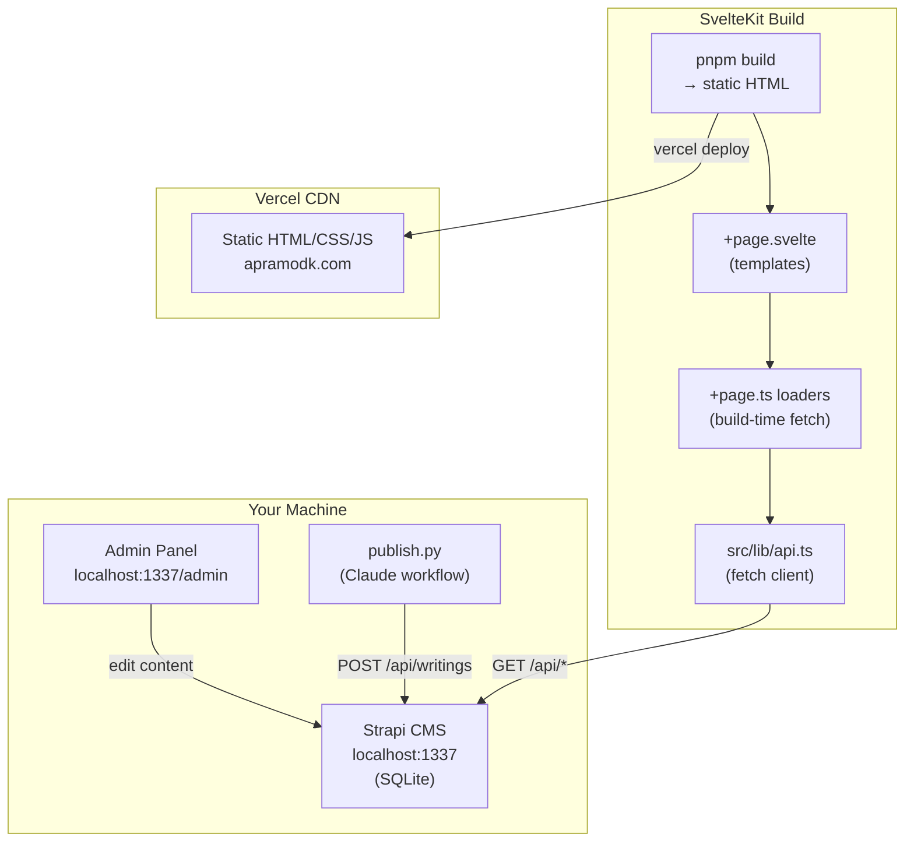
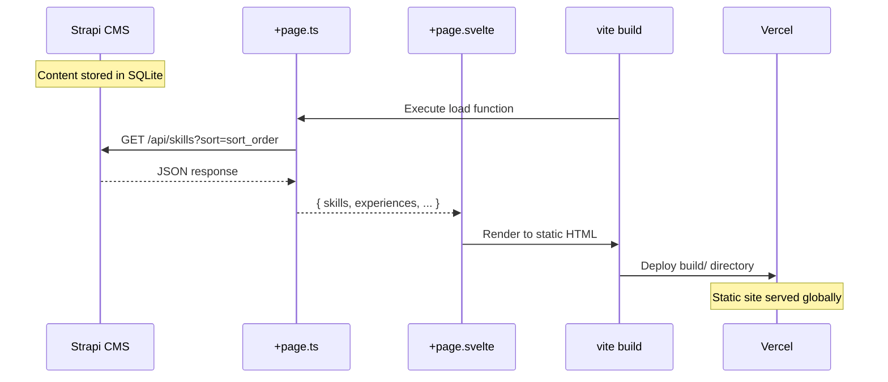
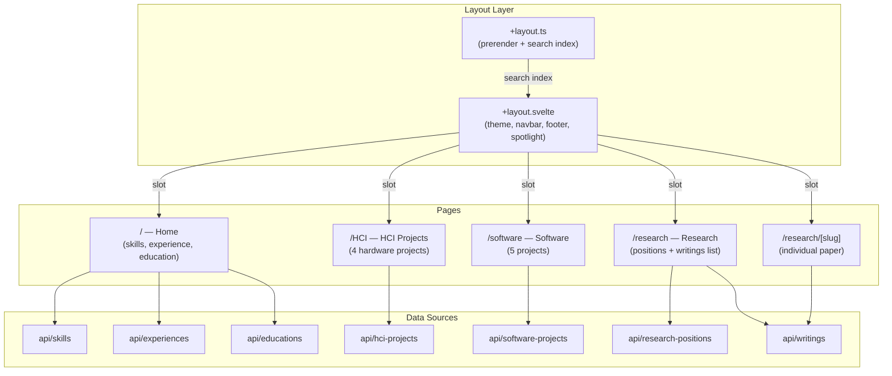
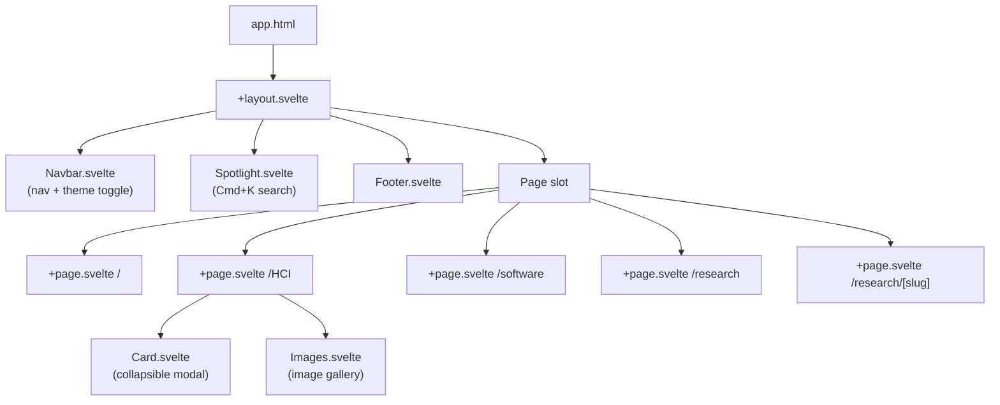
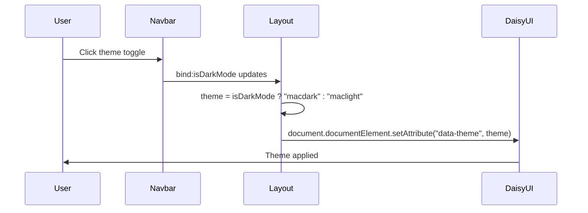
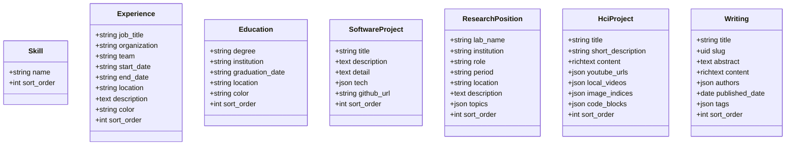

# Architecture

## System Overview



## Data Flow



## Route Structure



## Component Hierarchy



## Theme System



Two custom DaisyUI themes:
- **maclight** — warm light theme (#faf8f5 base, #3B7EA1 primary)
- **macdark** — warm dark theme (#2a2924 base, #5BA3C9 primary)

## CMS Content Types



## File Structure

```
pweb/
├── src/
│   ├── lib/
│   │   ├── api.ts                  # Strapi fetch client + types
│   │   ├── index.ts                # Component exports
│   │   ├── components/
│   │   │   ├── Navbar.svelte       # Nav + theme toggle
│   │   │   ├── Card.svelte         # Modal card (HCI page)
│   │   │   ├── Footer.svelte       # Footer
│   │   │   └── Spotlight.svelte    # Cmd+K search
│   │   └── images/
│   │       └── images.svelte       # Image gallery
│   └── routes/
│       ├── +layout.svelte          # Root layout
│       ├── +layout.ts              # Prerender + search index loader
│       ├── +page.svelte            # Home
│       ├── +page.ts                # Home loader
│       ├── HCI/+page.{svelte,ts}   # HCI projects
│       ├── software/+page.{svelte,ts}  # Software projects
│       └── research/
│           ├── +page.{svelte,ts}   # Research + writings list
│           └── [slug]/+page.{svelte,ts} # Individual paper
├── static/
│   ├── videos/                     # Local MOV files
│   └── favicons/
├── .env                            # VITE_STRAPI_URL, VITE_STRAPI_TOKEN
├── deploy.sh                       # Build + deploy to Vercel
├── svelte.config.js                # adapter-static
├── tailwind.config.js              # DaisyUI + Typography
└── vite.config.ts

~/strapi-cms/
├── .env                            # Strapi secrets
├── docker-compose.yml              # Docker setup (optional)
├── seed.mjs                        # Content migration script
├── publish.py                      # Claude publishing CLI
└── strapi-app/                     # Strapi project
    ├── src/api/                    # Content type schemas + routes
    └── .tmp/data.db                # SQLite database
```
