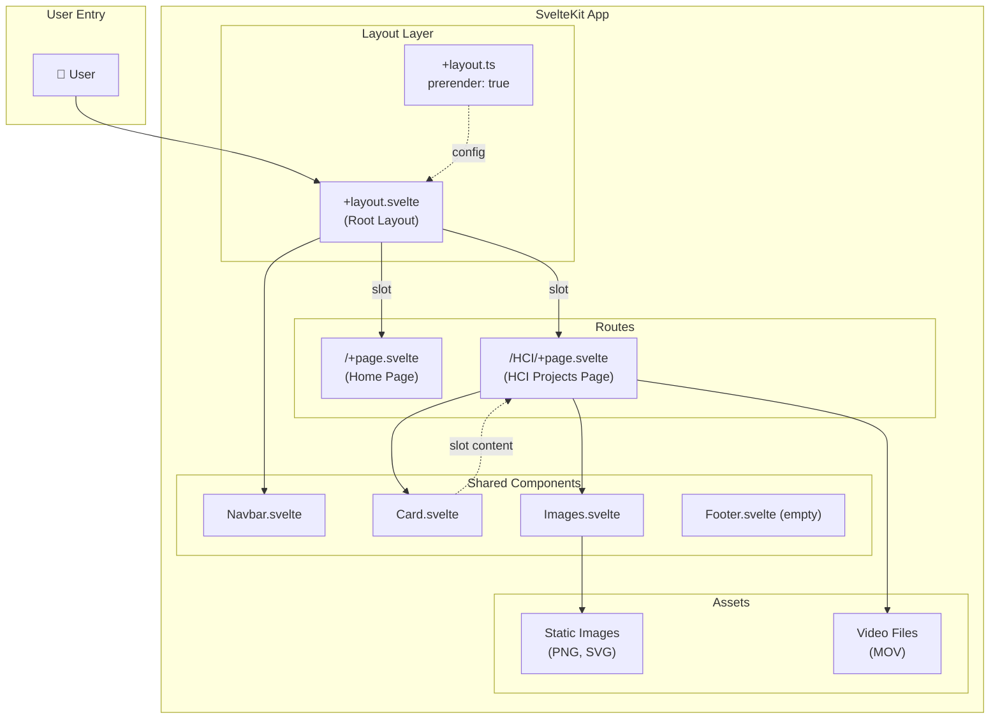
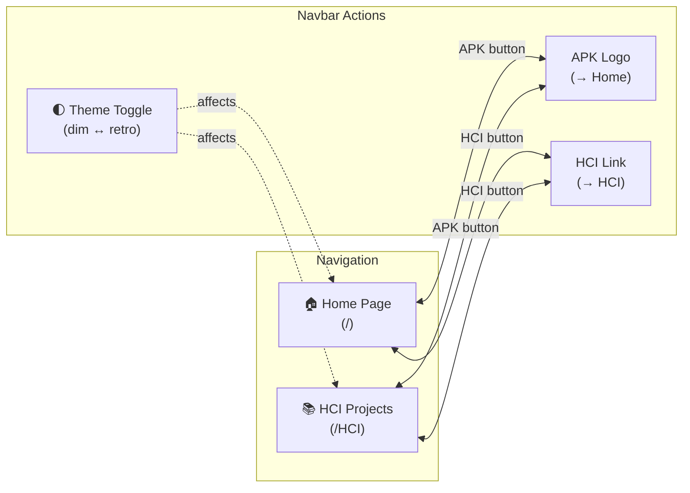
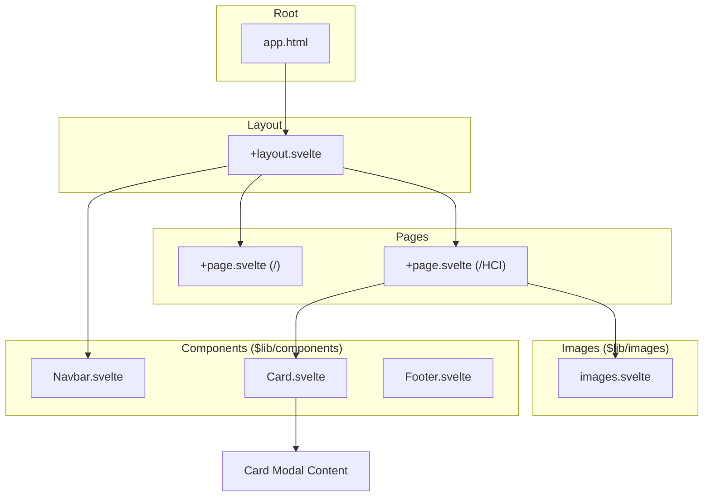
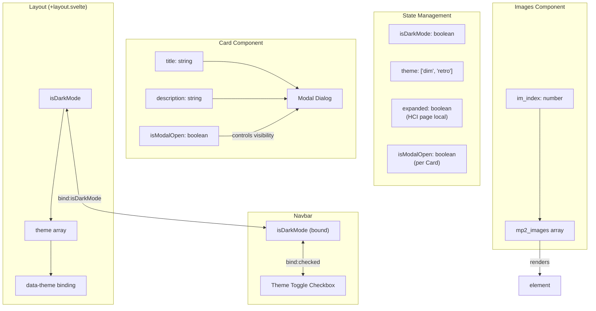
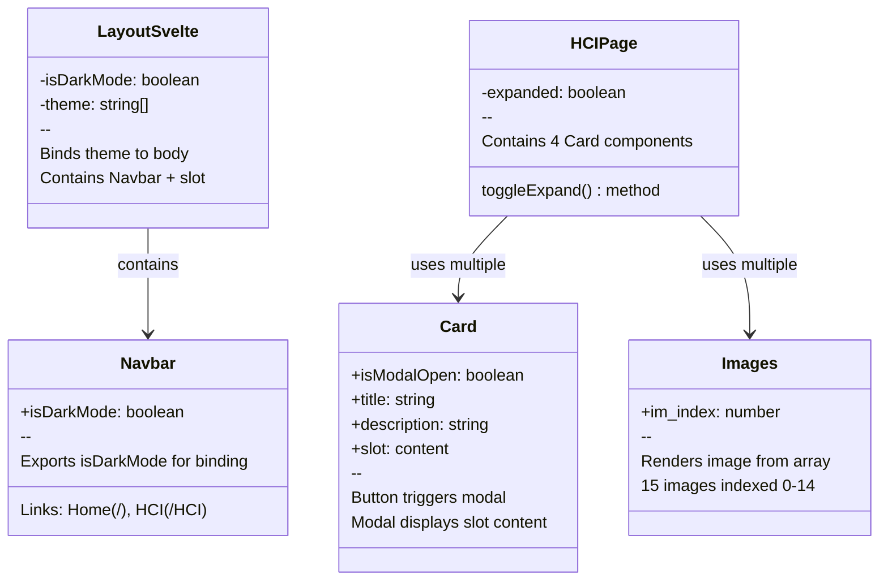
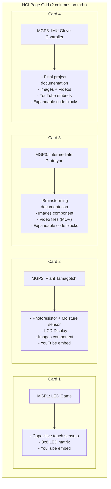
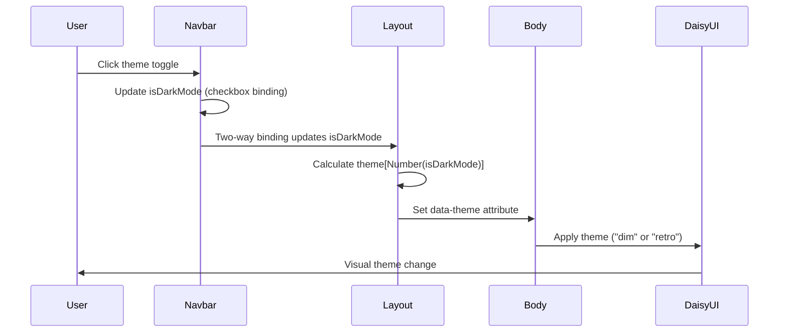

# Website Architecture Diagram

This document provides a comprehensive overview of the SvelteKit personal website architecture, including user flow, component hierarchy, and data flow.

## Overview



## User Navigation Flow



## Component Hierarchy



## Data Flow



## Component Props & Exports



## HCI Page - Card Structure



## Theme System Flow



## File Structure

```
src/
├── app.d.ts              # TypeScript declarations
├── app.html              # HTML template
├── lib/
│   ├── index.ts          # Barrel exports (Navbar, Card, Images)
│   ├── components/
│   │   ├── Navbar.svelte # Navigation + theme toggle
│   │   ├── Card.svelte   # Modal card component
│   │   └── Footer.svelte # Empty (unused)
│   └── images/
│       ├── images.svelte # Image array component
│       └── *.png/svg/MOV # Static assets
└── routes/
    ├── +layout.svelte    # Root layout (theme + navbar)
    ├── +layout.ts        # Prerender config
    ├── +page.svelte      # Home page (intro)
    └── HCI/
        └── +page.svelte  # HCI projects page
```

## Technology Stack

| Layer | Technology |
|-------|------------|
| Framework | SvelteKit |
| Styling | TailwindCSS + DaisyUI |
| Build | Vite |
| Language | TypeScript |
| Themes | dim (dark), retro (light) |
